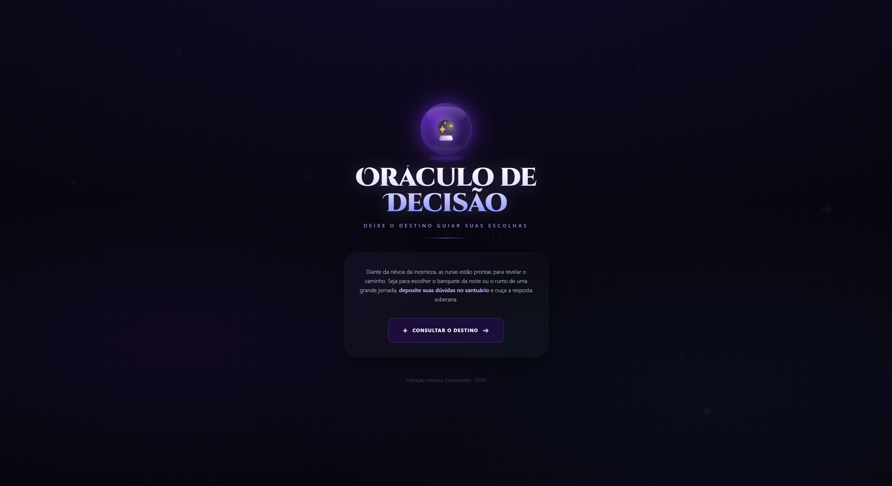
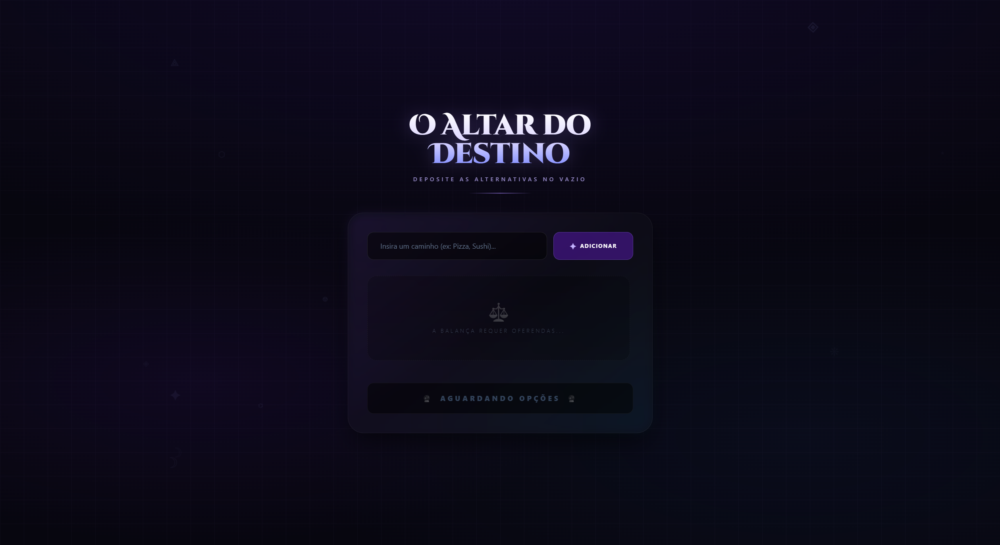
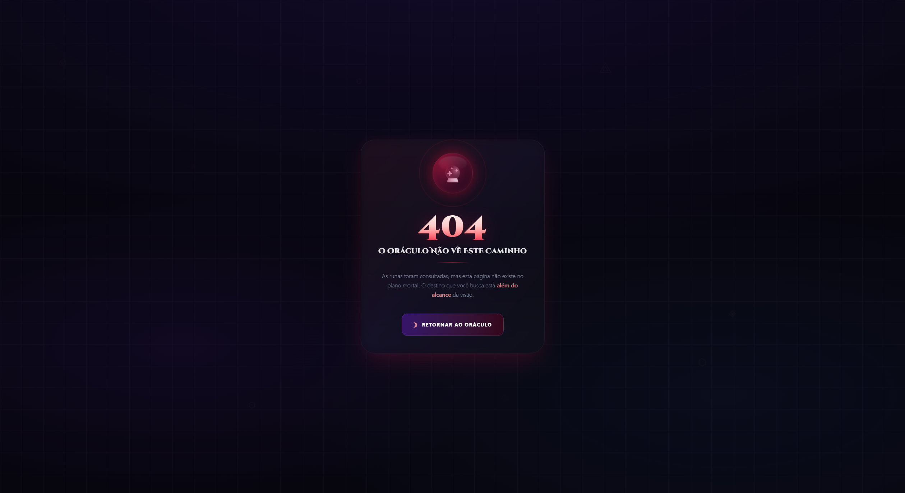

# 🔮 Oráculo de Decisão

<p align="center">
  <strong>Uma aplicação web interativa para ajudar usuários a tomarem decisões de forma simples, divertida e visualmente envolvente.</strong>
</p>

<p align="center">
  Projeto desenvolvido para a disciplina de <strong>Interação Humano-Computador</strong>.
</p>

---

## 📌 Sobre o Projeto

O **Oráculo de Decisão** é uma aplicação web criada com o objetivo de auxiliar pessoas em situações de indecisão.

A proposta é simples: o usuário informa duas ou mais opções e o sistema escolhe uma delas de forma aleatória, utilizando lógica em **JavaScript**. A escolha é apresentada ao usuário com uma interface temática, inspirada em um oráculo místico.

A aplicação trabalha conceitos importantes de **Interação Humano-Computador**, como clareza visual, feedback ao usuário, responsividade, organização das informações e experiência de uso.

Além da funcionalidade principal, o projeto também explora uma identidade visual própria, com fundo escuro, elementos decorativos, animações, gradientes e uma estética voltada para o tema de mistério e decisão.

---

## 🌐 Projeto Hospedado

O santuário está de portas abertas. Você pode consultar o Oráculo de Decisão diretamente através do seu navegador e deixar que o destino guie as suas escolhas, sem precisar instalar nada no seu computador.

🔗 **Acessar o Oráculo:** [Clique aqui para abrir o projeto](https://oraculo-decisao.netlify.app/)

---

## 🎯 Objetivo

O objetivo do projeto é desenvolver uma interface web criativa, intuitiva e responsiva, permitindo que o usuário interaja com o sistema de forma simples e agradável.

A aplicação busca transformar uma ação comum, como escolher entre duas ou mais opções, em uma experiência mais divertida e visualmente interessante.

---

## 📚 Disciplina

Projeto desenvolvido para a disciplina:

**Interação Humano-Computador**

A proposta do trabalho está relacionada à criação de uma aplicação com foco em usabilidade, experiência do usuário e construção de uma interface visualmente organizada.

---

## 👥 Autores

| Nome | Matrícula |
|---|---|
| Patrick Peres Nicolini | 22.1.8103 |
| Carlos Gabriel de Oliveira Frazão | 22.1.8100 |

---

## ✨ Funcionalidades

### 🎲 Sorteio de decisões

O usuário pode inserir duas ou mais opções, e o sistema escolhe uma delas de forma aleatória.

Exemplo:

```txt
Pizza ou Hambúrguer?
```

Resultado possível:

```txt
O oráculo escolheu: Pizza 🍕
```

---

### 🔀 Escolha aleatória com JavaScript

A lógica principal do sistema utiliza recursos do JavaScript para sortear uma opção cadastrada pelo usuário.

A escolha é feita com base em um índice aleatório gerado a partir da quantidade de opções disponíveis.

---

### 🌌 Interface temática

A aplicação possui uma identidade visual inspirada em elementos místicos, utilizando:

- Fundo escuro;
- Gradientes;
- Runas decorativas;
- Efeitos de brilho;
- Animações suaves;
- Elementos com transparência;
- Layout moderno e responsivo.

---

### 📱 Layout responsivo

O sistema foi pensado para funcionar bem em diferentes tamanhos de tela, como notebooks, desktops e dispositivos móveis.

---

### 🚫 Página Not Found personalizada

O projeto também possui uma página de erro personalizada para rotas inexistentes, mantendo a identidade visual do sistema.

---

## 🖼️ Protótipos

Nesta seção estão os caminhos reservados para os protótipos do projeto.

### 🏠 Página Principal

Protótipo referente à tela inicial do sistema, onde o usuário tem o primeiro contato com a proposta do projeto.



---

### 🔮 Página do Oráculo

Protótipo referente à tela principal de interação, onde o usuário informa as opções e recebe a decisão sorteada pelo sistema.



---

### 🚫 Página Not Found

Protótipo referente à página exibida quando o usuário acessa uma rota inexistente.



---

## 🛠️ Tecnologias Utilizadas

O projeto utiliza as seguintes tecnologias:

### ⚛️ React

Utilizado para a construção da interface por meio de componentes reutilizáveis.

---

### ⚡ Vite

Utilizado como ferramenta de criação e execução do projeto front-end, oferecendo um ambiente rápido e simples para desenvolvimento.

---

### 🟨 JavaScript

Utilizado para a lógica da aplicação, incluindo o funcionamento do sorteio aleatório.

---

### 🎨 Tailwind CSS

Utilizado para a estilização da interface, permitindo criar layouts responsivos e modernos de forma mais prática.

---

### 🎞️ Framer Motion

Utilizado ou previsto para animações e transições visuais, deixando a experiência do usuário mais fluida e interativa.

---

## 🚀 Como Baixar o Projeto

Para baixar o repositório em sua máquina, utilize o comando:

```bash
git clone URL_DO_REPOSITORIO
```

Depois, acesse a pasta do projeto:

```bash
cd nome-do-repositorio
```

Exemplo:

```bash
cd oraculo-de-decisao
```

---

## ⚙️ Como Rodar o Projeto

Como o projeto utiliza o **Vite**, a execução segue o padrão de projetos criados com essa ferramenta.

Primeiro, instale as dependências:

```bash
npm install
```

Depois, execute o projeto:

```bash
npm run dev
```

Após executar o comando, o terminal exibirá um endereço local semelhante a este:

```bash
http://localhost:5173
```

Acesse esse endereço no navegador para visualizar a aplicação.

---

## 🧪 Como Usar

1. Acesse a aplicação pelo navegador.
2. Informe duas ou mais opções.
3. Solicite a decisão ao oráculo.
4. O sistema sorteará uma das opções.
5. O resultado será exibido na tela com destaque visual.

---

## 💡 Exemplo de Funcionamento

```txt
Opções informadas:
- Pizza
- Hambúrguer
- Sushi

Resultado:
O oráculo escolheu: Hambúrguer 🍔
```
---

## ✅ Considerações Finais

O **Oráculo de Decisão** é um projeto acadêmico que une programação, criatividade e conceitos de Interação Humano-Computador.

Mesmo possuindo uma lógica simples, a aplicação demonstra como uma boa interface pode tornar uma funcionalidade comum mais interessante, acessível e agradável para o usuário.

O projeto reforça a importância de pensar não apenas no funcionamento técnico de um sistema, mas também na forma como o usuário interage, entende e se sente ao utilizar a aplicação.

---

## 📄 Licença

Este projeto foi desenvolvido exclusivamente para fins acadêmicos.
